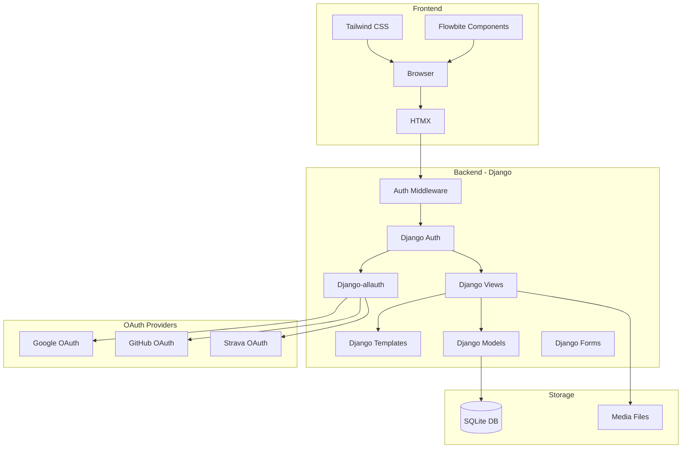

# Design Document: Work Clothes Tracker

## Overview

Application web de suivi de vêtements au travail construite avec Django, HTMX, Flowbite et Tailwind CSS. L'architecture privilégie la simplicité avec un rendu côté serveur enrichi par HTMX pour une expérience fluide sans JavaScript complexe. L'application inclut un système d'authentification hybride supportant les comptes locaux et OAuth (Google, GitHub, Strava).

## Architecture



## Components and Interfaces

### Django Models

```python
# models.py
from django.db import models
from django.contrib.auth.models import User

class ClothingItem(models.Model):
    class Status(models.TextChoices):
        AT_WORK = 'au_travail', 'Au travail'
        RETRIEVED = 'recupere', 'Récupéré'
        LOST = 'perdu', 'Perdu'
    
    class Type(models.TextChoices):
        TOP = 'haut', 'Haut'
        BOTTOM = 'bas', 'Bas'
        JACKET = 'veste', 'Veste'
        SHOES = 'chaussures', 'Chaussures'
    
    user = models.ForeignKey(User, on_delete=models.CASCADE, related_name='clothing_items')
    name = models.CharField(max_length=100)
    type = models.CharField(max_length=20, choices=Type.choices)
    color = models.CharField(max_length=50)
    photo = models.ImageField(upload_to='clothes/', blank=True, null=True)
    deposit_date = models.DateField(auto_now_add=True)
    location = models.CharField(max_length=100)
    status = models.CharField(
        max_length=20, 
        choices=Status.choices, 
        default=Status.AT_WORK
    )
    notes = models.TextField(blank=True)
    created_at = models.DateTimeField(auto_now_add=True)
    updated_at = models.DateTimeField(auto_now=True)
    
    class Meta:
        ordering = ['-deposit_date']

# Django-allauth will handle OAuth user creation automatically
# Additional user profile can be added if needed:
class UserProfile(models.Model):
    user = models.OneToOneField(User, on_delete=models.CASCADE)
    avatar = models.URLField(blank=True)  # From OAuth provider
    provider = models.CharField(max_length=50, blank=True)  # google, github, strava
```

### Django Views

```python
# views.py - Interface definitions
# Authentication handled by django-allauth
# Custom views only for application logic

class ClothingListView:
    """GET / - Liste des vêtements avec filtres (authentification requise)"""
    # Retourne HTML partiel si requête HTMX, page complète sinon
    # Filtre automatiquement par utilisateur connecté
    
class ClothingCreateView:
    """POST /add/ - Création d'un vêtement (authentification requise)"""
    # Retourne le nouvel élément en HTML pour insertion HTMX
    # Associe automatiquement à l'utilisateur connecté
    
class ClothingUpdateStatusView:
    """POST /item/<id>/status/ - Mise à jour du statut (authentification requise)"""
    # Vérifie que l'utilisateur possède l'item
    # Retourne l'élément mis à jour ou le supprime de la liste
    
class ClothingSearchView:
    """GET /search/ - Recherche et filtrage (authentification requise)"""
    # Retourne la liste filtrée en HTML partiel
    # Filtre automatiquement par utilisateur connecté
```

### Django-allauth Configuration

```python
# settings.py
AUTHENTICATION_BACKENDS = [
    'django.contrib.auth.backends.ModelBackend',
    'allauth.account.auth_backends.AuthenticationBackend',
]

SOCIALACCOUNT_PROVIDERS = {
    'google': {
        'SCOPE': ['profile', 'email'],
        'AUTH_PARAMS': {'access_type': 'online'},
    },
    'github': {
        'SCOPE': ['user:email'],
    },
    'strava': {
        'SCOPE': ['read'],
    }
}

ACCOUNT_EMAIL_REQUIRED = True
ACCOUNT_USERNAME_REQUIRED = False
ACCOUNT_AUTHENTICATION_METHOD = 'email'
SOCIALACCOUNT_AUTO_SIGNUP = True
```

### URL Patterns

```python
# urls.py
from django.contrib.auth.decorators import login_required
from django.urls import path, include

urlpatterns = [
    # Authentication (django-allauth)
    path('accounts/', include('allauth.urls')),
    
    # Application (protected)
    path('', login_required(ClothingListView.as_view()), name='clothing_list'),
    path('add/', login_required(ClothingCreateView.as_view()), name='clothing_add'),
    path('item/<int:pk>/status/', login_required(ClothingUpdateStatusView.as_view()), name='clothing_status'),
    path('search/', login_required(ClothingSearchView.as_view()), name='clothing_search'),
]

# Django-allauth provides these URLs automatically:
# /accounts/login/ - Login page with OAuth buttons
# /accounts/signup/ - Registration page
# /accounts/logout/ - Logout
# /accounts/google/login/ - Google OAuth
# /accounts/github/login/ - GitHub OAuth  
# /accounts/strava/login/ - Strava OAuth
```

### Templates Structure

```
templates/
├── base.html              # Layout principal avec Tailwind/Flowbite
├── account/               # Django-allauth templates (customized)
│   ├── login.html         # Page de connexion avec OAuth buttons
│   ├── signup.html        # Page d'inscription
│   └── logout.html        # Page de déconnexion
├── socialaccount/
│   └── connections.html   # Gestion des connexions OAuth
├── clothing/
│   ├── list.html          # Page d'accueil avec liste
│   ├── partials/
│   │   ├── item.html      # Carte d'un vêtement (réutilisable)
│   │   ├── item_list.html # Liste de vêtements (pour HTMX swap)
│   │   ├── form.html      # Formulaire d'ajout (modal)
│   │   └── filters.html   # Barre de filtres
```

## Data Models

### ClothingItem Entity

| Field | Type | Constraints | Description |
|-------|------|-------------|-------------|
| id | Integer | PK, auto | Identifiant unique |
| user | ForeignKey | Required, User | Propriétaire du vêtement |
| name | String(100) | Required | Nom du vêtement |
| type | Enum | Required | haut, bas, veste, chaussures |
| color | String(50) | Required | Couleur du vêtement |
| photo | ImageField | Optional | Photo uploadée |
| deposit_date | Date | Auto | Date de dépôt |
| location | String(100) | Required | Lieu de dépôt |
| status | Enum | Default: au_travail | au_travail, recupere, perdu |
| notes | Text | Optional | Notes additionnelles |

### User Entity (Django built-in + OAuth)

| Field | Type | Constraints | Description |
|-------|------|-------------|-------------|
| id | Integer | PK, auto | Identifiant unique |
| username | String(150) | Optional with OAuth | Nom d'utilisateur |
| email | EmailField | Required, unique | Adresse email |
| password | String | Optional with OAuth | Mot de passe hashé |
| first_name | String(150) | Optional | Prénom (from OAuth) |
| last_name | String(150) | Optional | Nom (from OAuth) |

### UserProfile Entity (Optional)

| Field | Type | Constraints | Description |
|-------|------|-------------|-------------|
| id | Integer | PK, auto | Identifiant unique |
| user | OneToOne | Required, User | Utilisateur associé |
| avatar | URLField | Optional | Avatar depuis OAuth |
| provider | String(50) | Optional | Fournisseur OAuth |

### Validation Rules

**Authentication**:
- `email`: Format email valide, unique
- `password`: Min 8 caractères, au moins une lettre et un chiffre (pour comptes locaux uniquement)
- OAuth providers handle their own validation

**ClothingItem**:
- `name`: Non vide, max 100 caractères
- `type`: Doit être une valeur de l'enum Type
- `color`: Non vide, max 50 caractères
- `location`: Non vide, max 100 caractères
- `status`: Doit être une valeur de l'enum Status
- `photo`: Formats acceptés: JPEG, PNG, WebP, max 5MB
- `user`: Doit correspondre à l'utilisateur authentifié


## Correctness Properties

*A property is a characteristic or behavior that should hold true across all valid executions of a system—essentially, a formal statement about what the system should do. Properties serve as the bridge between human-readable specifications and machine-verifiable correctness guarantees.*

### Property 1: Authentification requise pour l'accès

*For any* unauthenticated request to protected endpoints, the system SHALL redirect to the login page and prevent access to clothing data.

**Validates: Requirements 1.4**

### Property 2: OAuth et authentification locale

*For any* valid OAuth token from supported providers (Google, GitHub, Strava) or valid local credentials, the system SHALL authenticate the user and create a session.

**Validates: Requirements 1.1, 1.2, 1.7**

### Property 3: Isolation des données utilisateur

*For any* authenticated user, all displayed ClothingItems SHALL belong only to that user (user field matches authenticated user).

**Validates: Requirements 1.6, 2.1**

### Property 4: Liste filtrée par statut "Au travail"

*For any* authenticated user's list of ClothingItems in the database, the home page list SHALL only contain items where status equals "au_travail" and user equals the authenticated user.

**Validates: Requirements 2.1**

### Property 5: Tri par date de dépôt décroissante

*For any* authenticated user's list of ClothingItems displayed, the items SHALL be ordered such that for any two consecutive items A and B, A.deposit_date >= B.deposit_date.

**Validates: Requirements 2.2**

### Property 5: Affichage photo ou placeholder

*For any* ClothingItem belonging to the authenticated user, if photo is not null then the rendered output SHALL contain the photo URL, otherwise it SHALL contain a placeholder icon corresponding to the item's type.

**Validates: Requirements 2.3, 2.4**

### Property 6: Création d'un vêtement valide avec propriétaire

*For any* valid clothing form data (non-empty name, valid type, non-empty color, non-empty location) submitted by an authenticated user, creating a ClothingItem SHALL increase the user's total count by one, set the user field to the authenticated user, and the item SHALL be retrievable with matching attributes.

**Validates: Requirements 3.1**

### Property 7: Rejet des noms vides

*For any* form submission where name is empty or contains only whitespace, the system SHALL reject the creation and the user's item count SHALL remain unchanged.

**Validates: Requirements 3.2**

### Property 8: Valeurs par défaut à la création

*For any* newly created ClothingItem, the status SHALL be "au_travail" and the deposit_date SHALL be the current date if not explicitly provided.

**Validates: Requirements 3.4, 3.5**

### Property 9: Changement de statut avec vérification de propriété

*For any* ClothingItem with status "au_travail" belonging to the authenticated user, when the status is changed to "recupere" or "perdu", the item SHALL no longer appear in the home page list (filtered by "au_travail") and the change SHALL be rejected if the user doesn't own the item.

**Validates: Requirements 4.1, 4.2, 4.4**

### Property 10: Persistance des modifications (round-trip)

*For any* ClothingItem belonging to an authenticated user, after creation or modification, querying the database SHALL return an item with identical attributes to those that were saved.

**Validates: Requirements 4.3, 6.1, 6.2, 6.3**

### Property 11: Filtrage par champ unique avec isolation utilisateur

*For any* filter on a single field (type, color, location, or status) applied by an authenticated user, all items in the result set SHALL have that field matching the filter value AND belong to the authenticated user.

**Validates: Requirements 5.2, 5.3, 5.4, 5.5**

### Property 12: Recherche par nom avec isolation utilisateur

*For any* search term entered by an authenticated user, all items in the result set SHALL have a name that contains the search term (case-insensitive) AND belong to the authenticated user.

**Validates: Requirements 5.1**

### Property 13: Combinaison de filtres avec AND et isolation utilisateur

*For any* combination of multiple filters applied by an authenticated user, all items in the result set SHALL satisfy ALL filter conditions simultaneously AND belong to the authenticated user.

**Validates: Requirements 5.6**

## Error Handling

### Form Validation Errors

| Error | Condition | Response |
|-------|-----------|----------|
| Empty name | name is blank | Display error message, highlight field |
| Invalid type | type not in enum | Display error message, reset to default |
| Empty color | color is blank | Display error message, highlight field |
| Empty location | location is blank | Display error message, highlight field |
| Invalid image | file > 5MB or wrong format | Display error message, clear file input |

### Authentication Errors

| Error | Condition | Response |
|-------|-----------|----------|
| Invalid credentials | wrong email/password | Display error message, clear password |
| User not found | email doesn't exist | Display error message |
| Weak password | password < 8 chars or no digit/letter | Display validation error |
| Email already exists | email taken during registration | Display error message |
| OAuth error | OAuth provider rejects | Display error message, suggest retry |
| Unauthorized access | user tries to modify others' items | Return 403 Forbidden |

### HTMX Error Handling

- Network errors: Display toast notification with retry option
- Server errors (5xx): Display generic error message
- Validation errors (4xx): Return partial HTML with error messages

## Testing Strategy

### Unit Tests

- Authentication tests (local login, OAuth flows)
- Model validation tests (valid/invalid data)
- View response tests (correct templates, status codes)
- Authorization tests (user can only access own items)
- Form validation tests
- Filter logic tests

### Property-Based Tests

Using `hypothesis` library for Python:

- **Property 1-3**: Test authentication (local + OAuth) and user isolation with generated users and items
- **Property 4-6**: Test list display logic with generated ClothingItems per user
- **Property 7-9**: Test creation with generated valid/invalid form data per user
- **Property 10**: Test status transitions with generated items per user
- **Property 11**: Test persistence round-trip with generated items per user
- **Property 12-14**: Test filtering with generated items and filter combinations per user

Configuration:
- Minimum 100 iterations per property test
- Use `@given` decorator with custom strategies for ClothingItem generation

### Integration Tests

- Full HTMX request/response cycle
- Form submission with file upload
- Filter combination scenarios
